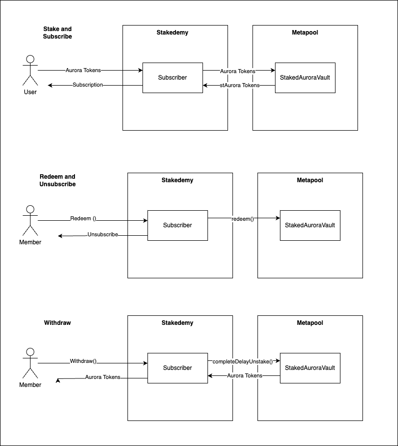

# Stakedemy 📚
Stakedemy the first Learn-to-earn platform in the Aurora Ecosystem. 
Stake your $Aurora and start learning all the Stakedemy content.
## Subscriber Contract 
- This contract handle the user subscription within the Aurora EVM. 
- Interface between Stakedemy and Metapool StakedAuroraVault contract.

## Technical Aspects 
- [Metapool Contract](https://github.com/Meta-Pool/staking-pool-aurora)
- We are using the release [v0.1.0 San Francisco](https://github.com/Meta-Pool/staking-pool-aurora/releases/tag/v0.1.0)

## Operation 

## How it works
1.	Access to the academy is set in either $Near or $Aurora.
2.	Users need to lock the required amount of tokens for 12 months on our platform.
3.	Our contract takes those tokens and stakes them in the Metapool protocol to obtain $stNear or $stAurora, depending on the token the user deposited.
4.	The liquid staking tokens are locked in our vault, and the rewards will be received by Stakedemy.
5.	70% of the rewards will be allocated to the gamification and incentive ecosystem for learning and development within the community.
6.	30% will go to Stakedemy.
7.	At the end of the 12-month period, users can retrieve the tokens they had locked in our vault, minus a 3% commission, in addition to all the rewards earned within Stakedemy.

## Quick run 
`
forge test 
`

